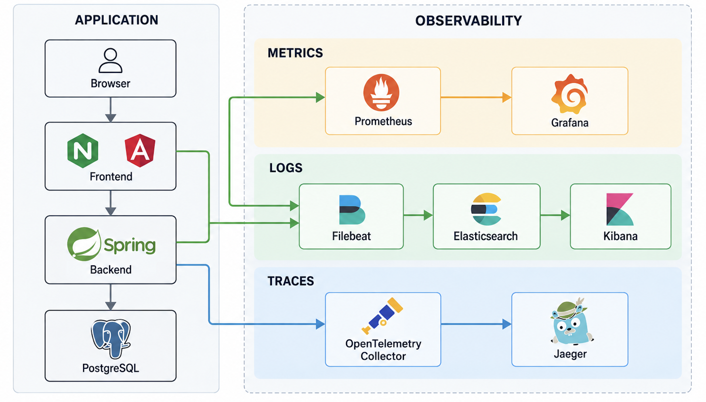

# Casino Wallet

Casino wallet application built with Kotlin, Spring Boot, PostgreSQL 16, Angular 17 and Docker Compose.

The project implements transactional real/bonus balances, deposits, welcome-bonus lifecycle, mixed-funds betting, an append-only ledger, concurrency protection and full operational observability.

<a href="assets/architecture/casino-wallet-observability-architecture.png">
  
</a>

## Prerequisites

### Docker

Required to run the containerized application:

- Docker Engine or Docker Desktop
- Docker Compose v2 with `up --wait` and `--wait-timeout`

Java, Node, npm and a local Gradle installation are **not required** for the Docker workflow.

### Local development and tests

Additionally required:

- JDK 21
- Node.js 20 (`>=20.9.0 <21`)
- npm
- Chrome or Chromium
- Bash

Tested locally with:

| Tool | Version |
|---|---|
| Docker Engine | 28.0.4 |
| Docker Compose | 2.34.0 |
| Java | Temurin 21.0.12.1 |
| Node.js | 20.20.2 |

The recommended Node version is recorded in `frontend/.nvmrc`.

---

## Quick Start

### Application

From the repository root:

```bash
./scripts/start-demo.sh
```

Open:

<http://localhost:4200>

The script builds and starts:

```text
postgres
backend
frontend
```

and waits for all healthchecks.

Stop while preserving PostgreSQL data:

```bash
./scripts/start-demo.sh stop
```

Reset local demo data:

```bash
./scripts/start-demo.sh reset
```

`reset` deletes the local PostgreSQL demo volume and financial history. Application images and Docker build cache are preserved.

### Full Stack with Observability

Start the application together with the complete monitoring stack:

```bash
./scripts/start-observability.sh
```

Open:

- Casino Wallet: <http://localhost:4200>
- Grafana: <http://localhost:3000>
- Prometheus: <http://localhost:9090>
- Kibana: <http://localhost:5601>
- Jaeger: <http://localhost:16686>

Stop only observability services while keeping Casino Wallet running:

```bash
./scripts/start-observability.sh stop
```

Detailed observability architecture, queries and troubleshooting are documented in [OBSERVABILITY.md](OBSERVABILITY.md).

## Run from IntelliJ IDEA

Shared Run Configurations are stored in `.run/`.

| Configuration | Purpose |
|---|---|
| `DEV - Full Stack` | Local backend + frontend with debugging and reload |
| `DEMO - Full Stack` | PostgreSQL + backend + frontend in Docker |
| `OBSERVABILITY - Full Stack` | Complete application and observability stack |
| `TEST - Backend` | Backend tests |
| `TEST - Frontend` | Frontend tests |

To start from IntelliJ IDEA:

1. Open **Run → Edit Configurations** or use the configuration selector in the top toolbar.
2. Select the required configuration.
3. Press **Run**.

For normal development:

`DEV - Full Stack`

For the containerized application:

`DEMO - Full Stack`

For the complete application with Prometheus, Grafana, Elasticsearch, Kibana, Filebeat, OpenTelemetry Collector and Jaeger:

`OBSERVABILITY - Full Stack`

No additional services need to be started manually.


### Native Docker Compose

Application only:

```bash
docker compose up --build
```

Application with observability:

```bash
docker compose \
  -f compose.yaml \
  -f compose.observability.yaml \
  --profile observability \
  up -d --build --wait --wait-timeout 300
```

No `.env` file is required. Local defaults can be overridden through shell variables or an ignored `.env` based on [.env.example](.env.example).

---

## Features

- Real and bonus balances in EUR
- Append-only financial ledger
- Pending deposits and HMAC-SHA256 provider callbacks
- Durable duplicate-callback idempotency
- One-time welcome bonus
- Wagering progress and seven-day expiration
- Real-first mixed-funds betting
- EUR 5 active-bonus stake limit
- Proportional real/bonus payout allocation
- Bonus completion and conversion
- Bonus expiration and forfeiture
- PostgreSQL row-lock concurrency protection
- Paginated ledger history
- English and Ukrainian UI
- Metrics, centralized logs and distributed tracing

For detailed business assumptions and interpretation decisions, see [NOTES.md](NOTES.md).

---

## Architecture

The backend is a modular monolith with explicit application, domain, persistence and web responsibilities.

```text
Browser
    ↓
Angular production bundle / Nginx
    ↓ REST / JSON
Kotlin / Spring Boot
    ↓ Spring JDBC
PostgreSQL 16
```

The core runtime contains three services:

```text
postgres
backend
frontend
```

The frontend container runs Nginx, which serves the Angular production bundle, proxies `/api`, exposes `/health` and propagates `X-Request-ID`.

The backend uses explicit Spring JDBC SQL. JPA and Hibernate are not used.

PostgreSQL is the source of truth for financial state.

### Technology Stack

| Component | Version |
|---|---|
| Java | 21 |
| Kotlin | 2.2.21 |
| Spring Boot | 3.5.16 |
| Gradle Wrapper | 8.14.3 |
| Angular | 17.3.12 |
| Angular CLI | 17.3.17 |
| TypeScript | 5.4.5 |
| PostgreSQL | 16.15 |
| Nginx | 1.28.2 |

Exact dependency and image versions are defined in the project build and container configuration.

---

## Development

### CLI

Start PostgreSQL:

```bash
docker compose up -d postgres
```

Start backend:

```bash
cd backend
DB_PORT=15432 ./gradlew bootRun
```

Start frontend:

```bash
cd frontend
npm ci
npm start
```

Use JDK 21 and Node 20.

### IntelliJ IDEA

Shared configurations are stored in `.run/`.

| Configuration | Purpose |
|---|---|
| `01 - PostgreSQL` | PostgreSQL only |
| `02 - Backend` | Local Spring Boot + PostgreSQL |
| `03 - Frontend` | Angular development server |
| `DEV - Full Stack` | Local backend + frontend |
| `DEMO - Full Stack` | Three-service Docker application |
| `OBSERVABILITY - Full Stack` | Complete ten-service environment |
| `TEST - Backend` | Backend tests |
| `TEST - Frontend` | Frontend tests |

To start the complete application with observability from IntelliJ:

1. Select `OBSERVABILITY - Full Stack`.
2. Press **Run**.

No additional services need to be started manually.

---

## Verification

Run:

```bash
./scripts/verify.sh
```

The verification pipeline runs:

```text
Backend
  → Gradle check
  → tests
  → executable bootJar

Frontend
  → npm ci
  → ChromeHeadless tests
  → Angular production build

Infrastructure
  → Docker Compose validation
```

Backend persistence and concurrency tests use real PostgreSQL Testcontainers. H2 is not used.

Kotlin compilation uses warnings-as-errors. TypeScript and Angular template checking remain strict.

---

## API

All endpoints operate on one seeded demo player.

| Method | Path | Purpose |
|---|---|---|
| GET | `/api/wallet` | Read balances and bonus state |
| POST | `/api/deposits` | Create a pending deposit |
| POST | `/api/provider/deposits/callback` | Complete a deposit through the signed provider callback |
| POST | `/api/demo/deposits/{depositId}/complete` | Complete the stored amount for the local demo |
| POST | `/api/rounds/play` | Play and settle one deterministic round |
| GET | `/api/ledger` | Read paginated financial history |

Money is transferred through the API as decimal strings.

Provider callback signatures use HMAC-SHA256 over the **exact raw request body**.

The demo completion endpoint takes no monetary input and exposes no provider signing secret to the browser.

Errors use Spring `ProblemDetail` with stable machine-readable codes.

---

## Financial Consistency

Financial writes execute in one application-service transaction using:

```text
READ_COMMITTED
```

Wallet-changing operations use:

```sql
SELECT ... FOR UPDATE
```

The lock order is:

```text
wallet
  ↓
related deposit when required
```

Wallet, ledger and related deposit/bonus/round state commit or roll back together.

Wallet mutations use `UPDATE ... RETURNING`, and every non-zero balance change has a corresponding ledger entry.

The ledger is append-only at the database level.

### Concurrency

The required concurrency scenario is covered by real PostgreSQL integration tests:

```text
initial balance = 10.00

concurrent bet A = 8.00
concurrent bet B = 8.00
```

Result:

```text
exactly one succeeds
exactly one is rejected
final balance = 2.00
```

The test verifies actual PostgreSQL lock contention rather than relying only on thread timing.

---

## Observability

The full stack provides:

```text
Metrics   → Prometheus → Grafana
Logs      → Filebeat → Elasticsearch → Kibana
Traces    → OpenTelemetry Collector → Jaeger
```

Request and trace correlation use:

```text
X-Request-ID / request_id
trace_id
span_id
```

Observability failures do not participate in financial transactions.

For startup instructions, dashboards, log queries, tracing, correlation, security and troubleshooting, see:

**[OBSERVABILITY.md](OBSERVABILITY.md)**

---

## Angular 17 Security Constraint

Angular is pinned to **17.3.12** because the assignment requires Angular 17.

Audit snapshot on **2026-09-24**:

| Audit | Findings |
|---|---|
| `npm audit --omit=dev` | 6: 3 moderate, 3 high |
| `npm audit` | 48: 4 low, 20 moderate, 23 high, 1 critical |

The project intentionally does not run:

```bash
npm audit fix --force
```

because automated remediation requires an Angular major-version upgrade.

A production deployment should upgrade Angular to a currently supported release.

---

## Documentation

- [NOTES.md](NOTES.md) — business assumptions and implementation decisions
- [OBSERVABILITY.md](OBSERVABILITY.md) — metrics, logs and distributed tracing
- [IMPLEMENTATION_PLAN.md](IMPLEMENTATION_PLAN.md) — implementation roadmap
- [DEVELOPMENT_STRATEGY.md](DEVELOPMENT_STRATEGY.md) — engineering and testing approach