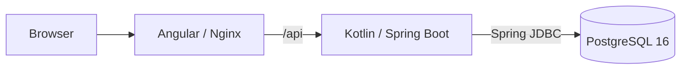

# Casino Wallet

A casino wallet assignment with a Kotlin/Spring Boot backend, Angular 17 interface, PostgreSQL 16 and Docker Compose. The required wallet functionality is implemented; final delivery verification is in progress.

## Prerequisites

- **Reviewer / Docker demo:** Docker Engine or Docker Desktop, with a running daemon, and Docker Compose v2 supporting `up --wait` and `--wait-timeout`.
- **Java, Node, npm and a Gradle installation are NOT required for the Docker reviewer workflow.** Builds run inside Docker.
- **Local DEV / tests additionally require:** JDK 21, Node 20 (`>=20.9.0 <21`), npm and Chrome/Chromium. Helpers use Bash and standard macOS/Linux shell utilities.

Tested locally with Docker Engine 28.0.4, Compose 2.34.0, Temurin 21.0.12.1 and Node 20.20.2. The recommended Node version is recorded in `frontend/.nvmrc`.

## Quick Start

From the repository root:

```bash
./scripts/start-demo.sh
```

**Open: [http://localhost:4200](http://localhost:4200).**

- **Stop and preserve financial/demo history:** `./scripts/start-demo.sh stop`
- **Intentionally reset local demo data:** `./scripts/start-demo.sh reset`

Reset deletes this Compose project's local demo volumes and financial history, removes project containers/network, and leaves the stack stopped. Stop preserves volumes. Both keep application images and build cache. If optional observability has been used, see [its separate cleanup instructions](OBSERVABILITY.md#shutdown-and-data) to remove monitoring data without deleting PostgreSQL.

Startup checks Docker prerequisites, validates Compose, builds backend/frontend images, starts `postgres`, `backend` and `frontend`, waits up to **180 seconds** for healthchecks, and prints URLs or useful failure diagnostics. Build time is separate from the health timeout. It leaves the application running and does not run tests or install host tooling.

No argument means `start`; `./scripts/start-demo.sh start` is equivalent. Use `--help` for the command summary. The script also works by full path from another directory; repeated starts reconcile the existing stack without resetting data.

### Configuration and native commands

No `.env` is required or created automatically. Compose uses disposable local defaults. To customize them, use the existing shell variables or an ignored `.env` based on [.env.example](.env.example).

| Setting | Default host address |
|---|---|
| `FRONTEND_PORT` | `localhost:4200` |
| `BACKEND_PORT` | `localhost:8080` |
| `POSTGRES_PORT` | `localhost:15432` |

The backend container always connects to `postgres:5432`; changing the PostgreSQL host port does not change its internal port.

Docker Compose remains available directly:

| Action | Native command |
|---|---|
| Build and start, attached to logs | `docker compose up --build` |
| Stop, preserve PostgreSQL data | `docker compose down` |
| Intentionally delete local demo data | `docker compose down -v` |

The helper uses detached startup with `--wait --wait-timeout 180` and adds `--remove-orphans` to stop/reset. It never removes application images or prunes unrelated Docker resources.

On a new database, Flyway applies V1–V6 and seeds one wallet with `0.00 / 0.00`, no bonus and empty deposit/round/ledger history. Existing volumes retain their state; migrations are schema history, not API versions.

If startup fails, inspect `docker compose ps --all` and `docker compose logs -f`. The helper already prints bounded recent logs and keeps failed containers available. Check for occupied host ports, including local DEV processes, before changing explicit port overrides.

## What the Application Demonstrates

- Real and bonus balances.
- An append-only financial ledger.
- HMAC-protected deposit callbacks.
- Durable callback idempotency.
- A one-time welcome bonus.
- Wagering progress.
- Real-first mixed-funds betting.
- Proportional payout allocation.
- Bonus completion and expiration.
- Concurrent wallet protection.
- An Angular English/Ukrainian interface.
- Paginated transaction history.

For a short UI walkthrough on a fresh database: create a `20.00` deposit, confirm that it is pending, use **Complete demo deposit**, then try a round with stake `5.00` and payout `0.00`. Inspect balances, bonus progress and history, and switch EN/UK. These actions persist demo financial history. Demo completion does not collect a real payment.

## Architecture



The backend is a modular monolith with application, domain, persistence and web responsibilities separated by feature. Persistence uses explicit Spring JDBC SQL, without JPA/Hibernate.

The default runtime has exactly three services: `postgres`, `backend`, `frontend`. Docker builder stages produce the executable JAR and Angular production bundle; backend and Nginx runtime containers run as non-root users. The optional observability profile described below adds monitoring services.

| Build component | Pinned version |
|---|---|
| Kotlin / Spring Boot | 2.2.21 / 3.5.16 |
| Gradle Wrapper | 8.14.3 |
| Angular / Angular CLI | 17.3.12 / 17.3.17 |
| TypeScript | 5.4.5 |
| PostgreSQL / Nginx | 16.15 / 1.28.2 |

Exact image tags and dependency versions are recorded in the Dockerfiles, `compose.yaml`, Gradle configuration and `frontend/package-lock.json`.

## Development and Testing

### DEV versus DEMO

| Mode | PostgreSQL | Backend / frontend | Purpose |
|---|---|---|---|
| DEV | Docker | Local JVM / Angular dev server | Debugging and fast reload |
| DEMO | Docker | Both in Docker | Reviewer workflow and production builds |

Stop local DEV processes before starting DEMO: both use host ports `8080` and `4200`. The lifecycle helper manages Compose containers, not local JVM/npm processes.

For CLI development, run these from the repository root in separate terminals:

```bash
docker compose up -d postgres
```

```bash
cd backend
DB_PORT=15432 ./gradlew bootRun
```

```bash
cd frontend
npm ci
npm start
```

Select Node 20 first (`nvm use` in `frontend/` if using nvm) and set `JAVA_HOME` to JDK 21. `npm ci` is needed initially and after dependency changes, not before every dev-server restart.

If `POSTGRES_PORT` changes, pass the same value as `DB_PORT` to the local backend. A local Spring Boot process does not automatically read the root `.env`; supply any `DB_HOST`, `DB_NAME`, `DB_USER`, `DB_PASSWORD` or `SERVER_PORT` overrides in its environment.

Angular reloads on source changes. Spring Boot DevTools restarts after compiled classes/resources change; use IntelliJ **Build Project** after backend edits. Frontend API URLs stay relative: the Angular dev proxy targets `localhost:8080`, while Nginx targets `backend:8080`.

### Shared IntelliJ profiles

Import `backend/build.gradle.kts`, select JDK 21 and Node 20, configure a Docker connection named `Docker` and the Chrome executable. Tool paths remain machine-local. Profiles are shared in [.run/](.run/).

| Profile | Behaviour |
|---|---|
| `01 - PostgreSQL` | Starts only PostgreSQL, publishing host port `15432`. |
| `02 - Backend` | Starts PostgreSQL first, then the local Spring Boot JVM. |
| `03 - Frontend` | Starts Angular and opens Chrome with JavaScript debugging. |
| `DEV - Full Stack` | Runs the local backend and frontend profiles together. |
| `DEMO - Full Stack` | Builds and starts the three Compose services. |
| `OBSERVABILITY - Full Stack` | Starts the complete optional ten-service environment. |
| `TEST - Backend` | Runs the Gradle `test` task; supports Kotlin test debugging. |
| `TEST - Frontend` | Runs Angular unit/component tests in ChromeHeadless. |

For individual TypeScript test debugging, use IntelliJ's Karma integration. Stopping local DEV sessions leaves detached PostgreSQL running; stop it separately with `docker compose stop postgres` when needed.

### Verification

```bash
./scripts/verify.sh
```

This requires the local DEV/test toolchain and runs:

- Backend Gradle checks, tests and executable `bootJar` build.
- Frontend `npm ci`, headless tests and production build.
- Docker Compose configuration validation.

It does not start the full demo stack. Conversely, `start-demo.sh` builds, starts and checks health without running this test pipeline.

Backend integration tests use isolated PostgreSQL Testcontainers, not the shared demo database or H2. They require Docker but no prior `01 - PostgreSQL` startup. Frontend tests use HTTP mocks and require no running backend. Set `CHROME_BIN` if Chrome/Chromium is not detected.

Tests cover money boundaries, schema constraints, HMAC/idempotency, rollback, bonus lifecycle, concurrency, UI validation, EN/UK and stale-response protection. Kotlin warnings-as-errors, strict TypeScript and Angular template checking remain enabled.

## Business Rules

- **Money:** EUR uses Kotlin `BigDecimal` and PostgreSQL `NUMERIC(19,2)`. Deposit/round inputs are decimal strings with at most two fractional digits; responses use exactly two. Excess precision is rejected, not silently rounded. The frontend performs no authoritative money arithmetic.
- **Deposits:** creation leaves the deposit `PENDING` without crediting balances. Completion credits its stored amount once.
- **Welcome bonus:** the first qualifying completed deposit of at least `20.00` grants `min(deposit, 100.00)` once per player. Smaller deposits do not consume eligibility; an earlier qualifying completion does.
- **Wagering and lifetime:** target is the original bonus ×20; the full stake advances progress while the bonus is `ACTIVE`. Lifetime is seven days (168 hours) from grant.
- **Stake:** spend real funds first, then active bonus funds. Every stake is limited to `5.00` while a bonus is `ACTIVE`, including fully real-funded stakes. Without an active bonus, use real funds only and apply no bonus stake cap.
- **Payout:** `totalWin` is total payout, not net profit. Allocate proportionally to the actual stake: round the real share once to cents with `HALF_UP`, then give the bonus share the exact remainder.
- **Completion:** reaching or exceeding the wagering target converts the remaining bonus balance to real money. A completing round settles its payout before conversion.
- **Expiration:** at or after the deadline, an incomplete active bonus forfeits its remaining balance; real money is unchanged. Completed wagering takes priority over expiration. Terminal status is retained and repeated resolution is idempotent.

Lifecycle resolution is lazy, using an injected `Clock`, with no scheduler. It occurs on wallet summary, valid matching pending-deposit completion and round execution. **Reading the wallet can therefore commit conversion or forfeiture.** Pending-deposit creation, invalid signatures, amount mismatches and completed duplicate callbacks do not trigger it.

## API Summary

All routes operate on one seeded demo player, without authentication or a client-selected player ID. Angular calls relative `/api` paths.

| Method | Path | Purpose |
|---|---|---|
| GET | `/api/wallet` | Current balances and bonus metadata after lifecycle resolution. |
| POST | `/api/deposits` | Create a pending deposit from an `amount` decimal string; HTTP 201. |
| POST | `/api/provider/deposits/callback` | Complete a deposit using its ID, integer cents and a valid HMAC signature. |
| POST | `/api/demo/deposits/{depositId}/complete` | Reviewer-only completion of the stored deposit amount, without a request body. |
| POST | `/api/rounds/play` | Play and settle a deterministic round atomically; HTTP 200. |
| GET | `/api/ledger` | Read paginated, newest-first transaction history. |

Wallet `bonus` is `null` before a grant; otherwise it includes `status`, `initialAmount`, `wageringProgress`, `wageringTarget` and `expiresAt`, including after completion/expiration. Timestamps use UTC ISO format.

Ledger pagination uses `page=0&size=20` by default, with size 1–100. Responses contain `items`, `page`, `size`, `totalElements` and `totalPages`; ordering is `created_at DESC, id DESC`. Signed `amount` and `balanceAfter` remain decimal strings. Each page has a consistent database snapshot; later page requests may see newly committed entries.

### Provider callback and demo completion

The provider body contains a UUID `depositId` and positive JSON integer `amountCents`. `X-Signature` is the 64-character hexadecimal HMAC-SHA256 of the **exact raw body bytes**, using the backend's `PAYMENT_PROVIDER_HMAC_SECRET`. Verification uses constant-time digest comparison before JSON parsing; reformatting the body requires a new signature.

A matching repeated callback returns HTTP 200 with `COMPLETED` without another credit, including after restart. A mismatched amount is rejected even for an already completed deposit. Both completion endpoints return the deposit ID and status.

**The demo endpoint is not a production payment endpoint.** The UI uses it to complete the stored amount through the same core transaction; it collects no payment and exposes no HMAC secret/signature to the browser. Disable or remove it before real deployment. The backend property `demo.enabled=false` disables it; in Compose, that setting must be passed explicitly to the backend container.

### Round example

With `10.00` real balance and no active bonus, request `POST /api/rounds/play`:

```json
{"stake":"4.00","totalWin":"10.00"}
```

HTTP 200:

```json
{
  "roundId": "<server-generated UUID>",
  "stake": "4.00",
  "totalWin": "10.00",
  "realBalance": "16.00",
  "bonusBalance": "0.00"
}
```

The result is `10.00 - 4.00 + 10.00 = 16.00`. Stake must be positive; payout may be zero. Values must fit `NUMERIC(19,2)` (maximum `99999999999999999.99`); JSON numeric amounts and exponent notation are not accepted. Allocation is server-owned, and client-supplied allocation fields are rejected.

### Errors

Errors use Spring `ProblemDetail` with a stable `code`; internal SQL and stack traces are not returned.

| HTTP | Code(s) | Meaning |
|---|---|---|
| 400 | `INVALID_DEPOSIT_AMOUNT`, `INVALID_ROUND_AMOUNT` | Invalid amount format, precision, sign or range. |
| 400 | `INVALID_CALLBACK`, `INVALID_REQUEST`, `INVALID_PAGINATION` | Invalid request body or pagination. |
| 401 | `INVALID_SIGNATURE` | Missing or invalid provider signature. |
| 404 | `DEPOSIT_NOT_FOUND` | Completion refers to an unknown deposit. |
| 409 | `DEPOSIT_AMOUNT_MISMATCH` | Callback amount differs from the stored deposit. |
| 409 | `INSUFFICIENT_FUNDS`, `MAX_BET_EXCEEDED` | The round cannot satisfy current funds/bonus rules. |
| 409 | `WALLET_BALANCE_LIMIT` | A credit or conversion would exceed the balance range. |
| 500 | `INTERNAL_ERROR` | Sanitized unexpected technical failure. |

## Reliability and Concurrency

- PostgreSQL is the financial source of truth. Current balances live in `wallet`; the ledger is audit history, not a runtime balance replay.
- Each financial write uses one application-service `READ_COMMITTED` transaction. Wallet changes, ledger and related deposit/bonus/round state commit or roll back together; success is returned only after commit.
- `SELECT ... FOR UPDATE` serializes wallet changes. Lock order is **wallet → related deposit when required**. There is no optimistic retry machinery, independent `REQUIRES_NEW` financial work or network call inside the transaction.
- Explicit `UPDATE ... RETURNING` supplies authoritative balances after mutation. Database checks, unique keys and foreign keys reinforce nonnegative balances, valid allocations, ledger signs and operation uniqueness.
- Every non-zero balance change has a ledger entry. Zero payout creates no win entry. PostgreSQL rejects ledger `UPDATE`, `DELETE` and `TRUNCATE`; schema administration remains the database owner's responsibility.
- Rejected rounds create no round, stake/win entry or wagering progress. Prior lifecycle resolution can still commit with an expected business rejection such as HTTP 409; technical failures roll back the whole transaction.

Real PostgreSQL tests prove that **two concurrent losing bets of 8.00 against 10.00, without an active bonus, produce exactly one success, one `INSUFFICIENT_FUNDS` rejection and a final balance of 2.00**. They verify actual database blocking, not just simultaneous thread starts.

Tests also cover concurrent callbacks/grants/progress, transaction rollback and separate REAL/BONUS wallet-to-ledger reconciliation. Financial fixtures include matching history instead of directly editing wallet balances.

## Observability

| Default URL | Purpose |
|---|---|
| [Backend readiness](http://localhost:8080/actuator/health/readiness) | Includes PostgreSQL connectivity; used by Compose. |
| [Backend health](http://localhost:8080/actuator/health) | Aggregate health. |
| [Backend liveness](http://localhost:8080/actuator/health/liveness) | JVM liveness independent of PostgreSQL. |
| [Backend metrics](http://localhost:8080/actuator/metrics) | Micrometer JVM, HTTP and datasource metrics. |
| [Frontend health](http://localhost:4200/health) | Nginx healthcheck. |

PostgreSQL uses `pg_isready`. Actuator also exposes `/actuator/info` and `/actuator/prometheus`; sensitive health details and unrelated management endpoints are not exposed.

Nginx and the backend propagate `X-Request-ID`, generating a replacement when necessary, and return it in responses and structured logs. Request-scoped MDC is cleared in `finally`.

Application logs go to stdout/stderr; Nginx provides access/error logs. Business successes are logged after commit, expected rejections are concise, and unexpected failures receive sanitized error logging. Credentials, HMAC secrets, signatures, authorization values and raw callback bodies are never logged.

## Optional Observability

The optional post-assignment stack on `develop` provides metrics (Prometheus/Grafana), logs (Filebeat/Elasticsearch/Kibana) and tracing (OpenTelemetry Collector/Jaeger):

```bash
./scripts/start-observability.sh
```

Open [Grafana](http://localhost:3000), [Kibana](http://localhost:5601) or [Jaeger](http://localhost:16686). Use `./scripts/start-observability.sh stop` to stop only monitoring and keep Casino Wallet running. This local stack requires more Docker memory than the simple demo.

Normal `docker compose up --build` and `./scripts/start-demo.sh` still start only the three application services, without trace export. Monitoring is not required by the assignment or for financial correctness/readiness. See [OBSERVABILITY.md](OBSERVABILITY.md) for correlation, queries, shutdown, monitoring-only cleanup and security limitations.

## Security / Angular 17 Constraint

Angular is pinned to **17.3.12** because the assignment requires Angular 17. Known npm audit findings remain; no forced major upgrade or unsafe dependency override is applied.

Audit snapshot on **2026-09-24**:

| Audit | Findings |
|---|---|
| `npm audit --omit=dev` | 6: 3 moderate, 3 high |
| `npm audit` | 48: 4 low, 20 moderate, 23 high, 1 critical |

Counts may change as advisories are published. A green build does not imply a clean security audit. A production deployment should upgrade to a supported Angular version before release.

The application is a client-side SPA without SSR or dynamic HTML rendering. Default database credentials and the default provider secret are disposable demo values, not production credentials; real secrets belong in backend environment configuration and must never be committed.

## Assumptions and Intentional Exclusions

One deterministic demo player is seeded. `totalWin` is trusted demo input, with no randomness or external game provider; production payout authority would belong to a trusted provider. Each valid play request represents a new round, with no invented round idempotency key.

Production authentication, external payment/game providers, Redis, Kafka, Kubernetes, an API gateway and a centralized monitoring/tracing stack are outside this assignment's scope.

Project references:

- [IMPLEMENTATION_PLAN.md](IMPLEMENTATION_PLAN.md) — implementation roadmap and remaining delivery work.
- [NOTES.md](NOTES.md) — approved business assumptions.
- [DEVELOPMENT_STRATEGY.md](DEVELOPMENT_STRATEGY.md) — engineering, testing and review approach.
