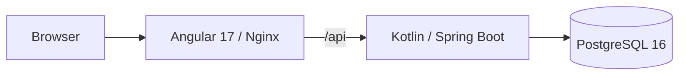

# Casino Wallet

A small casino wallet assignment built with Kotlin, Spring Boot, PostgreSQL and Angular 17.

The project is implemented in small, reviewable vertical slices with a green build required at the end of every stage.

> **Current status:** Stage 4 — Atomic Game Rounds and Concurrency.
>
> Signed provider callbacks complete deposits idempotently. Real-money game rounds debit a stake and settle a deterministic payout in one PostgreSQL transaction, with wallet row locking and immutable ledger history. Angular displays the authoritative wallet balances in EUR.
>
> Bonus lifecycle, mixed funds, wagering, deposit/round/ledger UI and translations are not implemented yet.

See:

- [IMPLEMENTATION_PLAN.md](IMPLEMENTATION_PLAN.md) — staged implementation roadmap
- [NOTES.md](NOTES.md) — assumptions and architectural decisions

---

# Architecture



The production/demo runtime consists of three separate services:

```text
Browser
   |
   v
frontend
Angular 17 + Nginx
   |
   | /api
   v
backend
Kotlin + Spring Boot
   |
   | JDBC
   v
postgres
PostgreSQL 16
```

Responsibilities:

```text
Frontend
  - serves Angular SPA
  - proxies /api
  - exposes /health
  - propagates X-Request-ID
  - writes access/error logs

Backend
  - REST API
  - business rules
  - transaction boundaries
  - observability
  - wallet locking and financial consistency

PostgreSQL
  - durable application state
  - source of truth for wallet balances
  - ACID transactions
  - database constraints
  - row locking
```

---

# Wallet Read API

`GET /api/wallet` reads the single demo player's wallet. It requires no authentication, query parameters or player ID in the URL.

```json
{
  "realBalance": "0.00",
  "bonusBalance": "0.00"
}
```

Both values are decimal strings with exactly two fractional digits. Angular preserves those strings and displays `Real balance` and `Bonus balance` in EUR, with loading and retry states when the backend is not yet available.

Flyway runs on backend startup in both DEV and DEMO. `V1__create_wallet.sql` creates `wallet` with `player_id UUID PRIMARY KEY` and two `NUMERIC(19,2) NOT NULL DEFAULT 0.00` balances, each protected by a nonnegative `CHECK`. `V2__seed_demo_wallet.sql` inserts one demo wallet for `00000000-0000-0000-0000-000000000001` with `0.00 / 0.00`. Applied migrations are recorded in `flyway_schema_history`; restarting does not reseed or reset balances.

The read path is controller → application service → Spring JDBC → PostgreSQL. Completed deposits, round stakes and round payouts update the real balance; the bonus balance is unchanged. Reload the page to read the latest committed balances.

---

# Deposits and Ledger API

The demo uses the same seeded player for deposit creation, wallet reads and ledger reads. There is no authentication or caller-selected player ID at this stage.

`V3__create_deposits_and_ledger.sql` adds `deposit` and `ledger_entry`; V1/V2 remain unchanged. Both tables reference the wallet and use `NUMERIC(19,2)` money with database constraints. A unique `(player_id, reference_type, reference_id, operation_type, wallet_type)` key prevents duplicate ledger operations. A PostgreSQL statement trigger rejects ledger `UPDATE`, `DELETE` and `TRUNCATE`, including direct SQL. Administrative schema changes remain the database owner's responsibility.

## Create a pending deposit

```bash
curl --fail-with-body -i http://localhost:4200/api/deposits \
  -H 'Content-Type: application/json' \
  -H 'X-Request-ID: deposit-create-example' \
  --data-binary '{"amount":"25.00"}'
```

HTTP `201`:

```json
{"depositId":"<server-generated UUID>","amount":"25.00","status":"PENDING"}
```

`amount` must be a positive plain decimal **string**, with at most two fractional digits, no exponent and a maximum of `99999999999999999.99`. `"25"` normalizes to `"25.00"`; extra fractional digits are rejected without rounding. Creating a pending deposit neither credits the wallet nor writes ledger history. It takes no wallet `FOR UPDATE` lock; PostgreSQL still performs normal foreign-key checks.

## Complete a deposit through the provider callback

`POST /api/provider/deposits/callback` accepts:

```json
{"depositId":"<existing UUID>","amountCents":2500}
```

`X-Signature` is the 64-character hexadecimal HMAC-SHA256 of the **exact request body bytes**, using `PAYMENT_PROVIDER_HMAC_SECRET` as a UTF-8 key. Hex letter case is ignored. Signature verification precedes JSON parsing and database access; decoded digests are compared with `MessageDigest.isEqual`. Reformatting JSON requires a new signature.

`amountCents` must be a positive JSON integer. Strings, fractional JSON numbers and values above `9999999999999999999` are rejected. Conversion uses `BigInteger` and `BigDecimal(cents, 2)`, preserving the full database range without floating point or `Long` overflow.

Compose and local Spring Boot share the harmless `local-demo-hmac-secret-change-me` default shown in `.env.example`. Override `PAYMENT_PROVIDER_HMAC_SECRET` in the backend environment for a different provider key. Compose reads `.env`; a local IDE/JVM run must receive the variable in its process environment. Never use the demo default for a real provider, commit a real secret, or log signatures/raw callback bodies.

After copying the returned deposit UUID into `DEPOSIT_ID`, this example signs and sends the same byte array. Set the signing process's secret to match the backend if overriding the demo default:

```bash
export DEPOSIT_ID='<UUID returned by POST /api/deposits>'
python3 - <<'PY'
import hashlib
import hmac
import json
import os
import urllib.request

body = json.dumps({"depositId": os.environ["DEPOSIT_ID"], "amountCents": 2500}, separators=(",", ":")).encode("utf-8")
secret = os.environ.get("PAYMENT_PROVIDER_HMAC_SECRET", "local-demo-hmac-secret-change-me").encode("utf-8")
signature = hmac.new(secret, body, hashlib.sha256).hexdigest()
request = urllib.request.Request("http://localhost:4200/api/provider/deposits/callback", data=body, headers={
    "Content-Type": "application/json",
    "X-Signature": signature,
    "X-Request-ID": "deposit-callback-example",
})
with urllib.request.urlopen(request) as response:
    print(response.status, response.read().decode("utf-8"))
PY
```

HTTP `200` returns `{"depositId":"<UUID>","status":"COMPLETED"}`. Repeating the correctly signed callback with the matching amount returns the same success without another credit or ledger row, including after a backend restart.

Completion runs in one application-service `READ_COMMITTED` transaction. An unlocked lookup discovers the owner, then rows are locked **wallet → deposit** with `SELECT ... FOR UPDATE`. The locked amount and status are checked again. The wallet credit, ledger insert and completion timestamp commit or roll back together. The credited balance comes from `UPDATE ... RETURNING`; success is logged and returned only after commit. Idempotency uses PostgreSQL state and uniqueness, with no cache or in-memory keys.

Errors use a safe Problem Detail response with a stable `code` and propagated `X-Request-ID`:

| Status | Code | Condition |
|---|---|---|
| 400 | `INVALID_DEPOSIT_AMOUNT` | Invalid creation amount |
| 400 | `INVALID_CALLBACK` | Signed but invalid callback JSON, UUID or cents |
| 400 | `INVALID_PAGINATION` | Negative page or size outside 1–100 |
| 400 | `INVALID_REQUEST` | Malformed request or unparseable query parameter |
| 401 | `INVALID_SIGNATURE` | Missing, malformed or incorrect signature, even for completed/unknown deposits |
| 404 | `DEPOSIT_NOT_FOUND` | A correctly signed callback references an unknown deposit |
| 409 | `DEPOSIT_AMOUNT_MISMATCH` | Callback amount differs, including after completion |
| 409 | `WALLET_BALANCE_LIMIT` | The credit would exceed `NUMERIC(19,2)` |
| 500 | `INTERNAL_ERROR` | An unexpected failure; no SQL or internal exception details are returned |

## Read ledger history

```bash
curl --fail-with-body 'http://localhost:4200/api/ledger?page=0&size=20'
```

The response contains `items`, `page`, `size`, `totalElements` and `totalPages`. Each item contains `id`, `walletType` (`REAL`), `operationType` (`DEPOSIT_COMPLETED`, `ROUND_STAKE` or `ROUND_WIN`), `amount`, `balanceAfter`, `referenceType` (`DEPOSIT` or `GAME_ROUND`), `referenceId` and UTC `createdAt`. Both money fields are two-decimal strings. Round stake amounts are negative, for example `"-8.00"`; deposits and round payouts are positive.

Pages start at zero; the default size is 20 and the maximum is 100. Empty/out-of-range pages return an empty `items` array with the actual totals. SQL sorts by `created_at DESC, id DESC`, backed by a matching player/history index. Items and totals use one read-only PostgreSQL snapshot per request; separate page requests can naturally observe newly committed deposits or rounds.

---

# Atomic Real-Money Rounds API

`POST /api/rounds/play` plays and settles one synchronous round for the same seeded demo player. Both input amounts must be plain decimal **strings** with at most two fractional digits and a maximum of `99999999999999999.99`. Stake must be positive; total payout may be zero. `"8"` normalizes to `"8.00"`; values such as `"8.001"`, negative amounts, exponents and JSON numbers are rejected without rounding.

With a real balance of `10.00`, funded through the deposit/callback API:

```bash
curl --fail-with-body -i http://localhost:4200/api/rounds/play \
  -H 'Content-Type: application/json' \
  -H 'X-Request-ID: round-example' \
  --data-binary '{"stake":"4.00","totalWin":"10.00"}'
```

HTTP `200`:

```json
{"roundId":"<server-generated UUID>","stake":"4.00","totalWin":"10.00","realBalance":"16.00","bonusBalance":"0.00"}
```

`totalWin` is deterministic demo input representing **total payout**, not net profit: `10.00 - 4.00 + 10.00 = 16.00`. There is no randomness or external game provider. Production payout authority would belong to a trusted provider, outside this assignment. Each accepted play request creates a new round; no round idempotency key is defined.

The application service owns one `READ_COMMITTED` transaction:

1. Lock the wallet and read its balances with `SELECT ... FOR UPDATE`.
2. Check that the current real balance covers the complete stake.
3. Debit real money with `UPDATE ... RETURNING real_balance` and append `ROUND_STAKE` with a negative amount and the resulting `balance_after`.
4. Insert the `game_round` with its stake and total payout.
5. For a positive payout, credit real money with `UPDATE ... RETURNING real_balance` and append `ROUND_WIN` with a positive amount and its resulting `balance_after`.
6. Commit before logging or returning success.

A zero payout produces no credit and no `ROUND_WIN` row. For the example above the two round ledger entries are `-4.00 / balanceAfter 6.00` and `+10.00 / balanceAfter 16.00`. Wallet, round and both ledger entries commit or roll back together, including on commit-time failure. Rounds lock only the wallet; deposit callbacks retain their existing **wallet → deposit** lock order. The ledger remains audit history; current balances are always read from the wallet.

| Status | Code | Result |
|---|---|---|
| 400 | `INVALID_ROUND_AMOUNT` | Invalid stake or totalWin; no financial writes |
| 400 | `INVALID_REQUEST` | Malformed JSON/request; no financial writes |
| 409 | `INSUFFICIENT_FUNDS` | Real balance cannot cover stake, even if the proposed payout would cover it; no round, ledger entry or balance change |
| 409 | `WALLET_BALANCE_LIMIT` | Payout would overflow `NUMERIC(19,2)`; the complete round rolls back |
| 500 | `INTERNAL_ERROR` | Technical failure; the complete round rolls back and internal details remain private |

`V4__create_game_rounds.sql` extends the schema without changing V1–V3. `game_round` contains only `id UUID PRIMARY KEY`, `player_id UUID NOT NULL REFERENCES wallet`, `stake NUMERIC(19,2) NOT NULL`, `total_win NUMERIC(19,2) NOT NULL` and `created_at TIMESTAMPTZ NOT NULL`. Database checks require positive stake and nonnegative payout within the money range. There is no pending/settled state for synchronous rounds.

V4 extends the existing ledger constraints: deposit credits reference `DEPOSIT` and remain positive; `ROUND_STAKE` and `ROUND_WIN` reference `GAME_ROUND` and must be negative and positive respectively. Zero entries and `BONUS` wallet type remain forbidden. The existing unique business-operation key, balance constraints and append-only trigger are preserved; ledger `UPDATE`, `DELETE` and `TRUNCATE` remain rejected.

PostgreSQL integration tests fund the wallet through signed deposits and prove that two concurrent `8.00` losing bets against `10.00` produce exactly one success and one `INSUFFICIENT_FUNDS` response, leaving `2.00`, one round and one stake entry. A controlled transaction holds the wallet row lock; bounded polling follows `pg_blocking_pids` from its known backend PID to prove that both requests actually wait in PostgreSQL. No SQL-text matching or timing-only concurrency proof is used. Tests also verify rollback and `sum(REAL ledger amounts) = wallet.real_balance`.

Stage 4 uses real money only: the entire stake and payout belong to real balance. Bonus handling, the active-bonus EUR `5.00` restriction and mixed real/bonus allocation belong to Stage 5 and are not implemented. The Angular round form belongs to the later frontend stage; the existing wallet page continues to display backend balances.

---

# Run Modes

The project intentionally supports **two different execution modes**.

They solve different problems and should not be confused.

| Mode | PostgreSQL | Backend | Frontend | Primary purpose |
|---|---|---|---|---|
| **DEV** | Docker | Local / IntelliJ | Local Angular dev server | Fast development, debugging, hot reload |
| **DEMO** | Docker | Docker | Docker + Nginx | Reproducible reviewer / clean-clone execution |

## DEV mode

Preferred during active development:

```text
Browser
   |
   v
Angular Dev Server
localhost:4200
   |
   | /api proxy
   v
Spring Boot
localhost:8080
   |
   | JDBC
   v
PostgreSQL
Docker
```

Advantages:

- Kotlin breakpoints in IntelliJ IDEA
- TypeScript/JavaScript debugging
- Angular live reload
- Spring Boot DevTools restart
- faster feedback loop
- no Docker image rebuild after every source change

## DEMO mode

Used for reviewer verification:

```text
Browser
   |
   v
Frontend container
Angular build + Nginx
   |
   v
Backend container
Spring Boot
   |
   v
PostgreSQL container
```

The complete application starts with:

```bash
docker compose up --build
```

This mode proves that the repository can be cloned and run reproducibly without relying on the developer's IDE configuration.

---

# Repository Structure

```text
casino-wallet/
├── backend/                 Spring Boot application and backend Docker image
├── frontend/                Angular application and Nginx Docker image
├── scripts/
│   └── verify.sh            Local verification pipeline
├── compose.yaml             PostgreSQL, backend and frontend services
├── README.md
├── NOTES.md
├── IMPLEMENTATION_PLAN.md
├── AGENTS.md
├── .env.example
└── .gitignore
```

The local `docs/` directory contains private development notes and is intentionally excluded from Git.

---

# Technology Stack

| Component | Version |
|---|---|
| Java container images | `eclipse-temurin:21.0.12_8-jdk-noble` / `21.0.12_8-jre-noble` |
| Gradle Wrapper | `8.14.3` |
| Kotlin | `2.2.21` |
| Spring Boot | `3.5.16` |
| Flyway core / PostgreSQL module | `11.7.2` (Spring Boot dependency management) |
| Testcontainers | `1.21.4` |
| PostgreSQL | `postgres:16.15-alpine3.23` |
| Node builder | `node:20.20.2-alpine3.22` |
| Angular | `17.3.12` |
| Angular CLI | `17.3.17` |
| TypeScript | `5.4.5` |
| Nginx | `nginxinc/nginx-unprivileged:1.28.2-alpine` |

Top-level npm dependencies use exact versions and transitive dependencies are pinned by `package-lock.json`.

Gradle dependency versions are reproducible through the committed Gradle Wrapper and Spring Boot dependency management.

---

# Prerequisites

## DEMO mode

Required:

- Docker Engine or Docker Desktop
- Docker Compose v2
- `curl` for optional manual smoke checks

Tested with:

```text
Docker Engine: 28.0.4
Docker Compose: 2.34.0
```

No local Java or Node installation is required to run the complete containerized stack.

## DEV mode

Additionally required:

- JDK 21
- Node.js `>=20.9.0 <21`
- npm
- Bash
- Chrome or Chromium
- running Docker daemon for PostgreSQL and Testcontainers

Recommended Node version:

```text
20.20.2
```

The repository contains:

```text
frontend/.nvmrc
```

For `nvm` users:

```bash
cd frontend
nvm use
```

Verify the local environment:

```bash
java -version
node --version
npm --version
docker compose version
```

Expected major versions:

```text
Java: 21
Node: 20
Docker Compose: 2
```

Set `JAVA_HOME` to JDK 21.

If Chrome is not detected automatically by frontend tests, configure `CHROME_BIN`.

---

# DEMO Mode — Full Containerized Run

This is the recommended way for a reviewer to run the project.

## 1. Create local environment configuration

From the repository root:

```bash
cp .env.example .env
```

The values in `.env.example` are disposable local defaults, not production credentials.

The real `.env` file is ignored by Git.

## 2. Start the complete stack

```bash
docker compose up --build
```

Docker Compose starts:

```text
postgres
   ↓ healthy

backend
   ↓ ready

frontend
   ↓ healthy
```

PostgreSQL defaults to `localhost:15432`, including when no `.env` exists. To use another host port, set `POSTGRES_PORT` in `.env` or export it in the shell, for example:

```text
POSTGRES_PORT=25432
```

The internal container connection remains:

```text
postgres:5432
```

Only the host mapping changes.

## Service URLs

| Service | Default address |
|---|---|
| Frontend | http://localhost:4200 |
| Frontend health | http://localhost:4200/health |
| Backend health | http://localhost:8080/actuator/health |
| Backend liveness | http://localhost:8080/actuator/health/liveness |
| Backend readiness | http://localhost:8080/actuator/health/readiness |
| Backend info | http://localhost:8080/actuator/info |
| Backend metrics | http://localhost:8080/actuator/metrics |
| PostgreSQL | localhost:15432 |

Inspect the stack:

```bash
docker compose ps
```

Inspect logs:

```bash
docker compose logs -f
```

Stop the stack:

```bash
docker compose down
```

The PostgreSQL named volume is preserved.

Use:

```bash
docker compose down -v
```

only when the local database should intentionally be deleted.

Backend and frontend containers run as non-root users.

Runtime images contain runtime artifacts only, not project source trees or build caches.

---

# DEV Mode — Fast Local Development

DEV mode is the preferred workflow while changing application code.

The architecture is:

```text
PostgreSQL -> Docker
Backend    -> local JVM / IntelliJ IDEA
Frontend   -> local Angular dev server
Browser    -> Chrome
```

---

## 1. Start PostgreSQL

From the repository root:

```bash
docker compose up -d postgres
```

If local port `15432` is occupied, choose another host port:

```bash
POSTGRES_PORT=25432 docker compose up -d postgres
```

Check health:

```bash
docker compose ps postgres
```

Expected:

```text
healthy
```

---

## 2. Start backend locally

From:

```bash
cd backend
```

With the default Compose host port:

```bash
DB_PORT=15432 ./gradlew bootRun
```

If you override `POSTGRES_PORT`, pass the same value as `DB_PORT` to the local backend.

Backend URL:

```text
http://localhost:8080
```

Health checks:

```bash
curl http://localhost:8080/actuator/health/liveness
curl http://localhost:8080/actuator/health/readiness
```

Expected:

```json
{"status":"UP"}
```

Spring Boot DevTools supports application restart after compiled classes change.

---

## 3. Start frontend locally

In another terminal:

```bash
cd frontend
nvm use
npm start
```

or without `nvm`:

```bash
cd frontend
npm start
```

Frontend URL:

```text
http://localhost:4200
```

Angular development server provides live reload.

---

# Local API Proxy

Browser code always uses relative API URLs:

```text
/api/*
```

In DEV mode:

```text
Browser
   ↓
Angular Dev Server :4200
   ↓
proxy.conf.json
   ↓
Spring Boot :8080
```

The proxy target is:

```text
http://localhost:8080
```

This avoids development-only CORS configuration.

In DEMO mode:

```text
Browser
   ↓
Nginx
   ↓
/api
   ↓
backend:8080
```

`GET /api/wallet` returns HTTP `200` with the wallet JSON through either proxy. Unimplemented routes still return `404`.

---

# IntelliJ IDEA Development Workflow

Seven shared profiles are stored in `.run/` and appear in **Run / Debug Configurations** when the repository root is opened in IntelliJ IDEA.

## One-time IDE setup

- Link `backend/build.gradle.kts` as a Gradle project and let the import finish. The backend profile uses the imported `com.example.casino-wallet.main` module.
- Select JDK 21 as the Project SDK and Gradle JVM.
- Select Node 20 as the project Node runtime and its npm as the project package manager. `frontend/.nvmrc` remains the CLI version reference. Run `npm ci` in `frontend/` once before starting the dev server or frontend tests.
- Configure a local Docker connection named `Docker` in **Settings → Build, Execution, Deployment → Docker**, and start the Docker daemon.
- Configure the installed Chrome executable in **Settings → Tools → Web Browsers and Preview**. IntelliJ must have its Spring Boot, Docker, npm and JavaScript debugging support available.

JDK, Node, Docker socket and browser executable locations are machine-local IDE settings. Shared profiles contain project-relative paths and no credentials.

| Profile | Native type | Behaviour |
| --- | --- | --- |
| `01 - PostgreSQL` | Docker Compose | Starts only `postgres` in detached mode with `POSTGRES_PORT=15432`. |
| `02 - Backend` | Spring Boot | Starts PostgreSQL as a Before Launch task, then the local JVM with `DB_HOST=localhost` and `DB_PORT=15432`. |
| `03 - Frontend` | npm | Runs `npm run start` from `frontend/package.json`, opens `http://localhost:4200` in Chrome and starts the browser JavaScript debugger. |
| `DEV - Full Stack` | Compound | Starts `02 - Backend` and `03 - Frontend` together. PostgreSQL is supplied by the backend prerequisite. |
| `DEMO - Full Stack` | Docker Compose | Builds and starts `postgres`, `backend` and `frontend` from the existing `compose.yaml`, equivalent to `docker compose up --build`. |
| `TEST - Backend` | Gradle | Runs `test` in `backend/` with the project Gradle JVM. Testcontainers supplies isolated PostgreSQL containers. |
| `TEST - Frontend` | npm | Runs `npm test` from `frontend/package.json`: Angular unit/component tests with HTTP mocks and ChromeHeadless. |

## TEST: isolated test runs

**TEST - Backend → Run** executes all backend tests. **Debug** attaches to the test JVM and supports breakpoints in Kotlin tests and application code. The profile enables **Run as test**, so each launch reruns the tests even when Gradle considers them up to date. Gradle script debugging is disabled. A running Docker daemon is required; there is no Before Launch dependency on `01 - PostgreSQL` or the shared database on port `15432`.

**TEST - Frontend → Run** uses the existing `test` script, which already specifies `--watch=false --browsers=ChromeHeadless`. Install Chrome locally; for a nonstandard browser location, supply `CHROME_BIN` in the local launch environment. The profile uses the project Node 20 runtime and has no backend, PostgreSQL or Docker prerequisite.

For a single Kotlin test, use its gutter **Debug** action. For TypeScript test breakpoints, use the test's gutter **Debug** action with IntelliJ's Karma integration; debugging the npm process alone does not attach to browser tests. The [Karma plugin](https://www.jetbrains.com/help/idea/running-unit-tests-on-karma.html) must be installed and enabled for this workflow.

## DEV: Run, Debug and reload

Select **DEV - Full Stack → Run** for local development, or **Debug** for Kotlin and TypeScript breakpoints. The backend runs on JDK 21 and the frontend uses the project Node runtime. Browser JavaScript debugging is enabled for both actions.

The IDEA DEV database mapping is always `127.0.0.1:15432 → postgres:5432`; port `5432` inside the container is unchanged. Existing development database defaults are reused.

The frontend and backend can start in parallel, so the page may become available before backend readiness turns `UP`. Angular keeps the existing `/api` proxy to `http://localhost:8080`; use **Retry** if the initial wallet request arrives before the backend is ready.

Angular watches source files and reloads the browser. Spring Boot DevTools restarts the backend when compiled classes or resources change; use **Build Project** after backend edits. Kotlin breakpoints work directly in backend sources, and browser source maps support TypeScript breakpoints. If a startup breakpoint was passed before the browser debugger attached, reload the page.

Use IntelliJ's **Stop** menu to stop the DEV child sessions together (or **Stop All** when only this stack is running). The detached PostgreSQL service remains available. Stop it separately in Docker Services or with `docker compose stop postgres`; its named volume is preserved. Close the debug Chrome window before a fresh launch if IDEA reports that its browser profile is already in use.

## DEMO and CLI

Stop the local DEV processes before launching DEMO because both modes use host ports `8080` and `4200`. DEMO builds both application images and retains the existing Compose healthchecks and startup dependencies. Stop the stack through Docker Services or `docker compose stop`; do not select volume removal.

DEMO uses normal Compose environment settings: PostgreSQL defaults to host port `15432`, also without `.env`. Override `POSTGRES_PORT` through `.env` or the shell if needed; the backend container continues to connect to `postgres:5432`.

All CLI workflows remain independent of IntelliJ, including `docker compose up --build`, `DB_PORT=15432 ./gradlew bootRun`, `npm start` and `./scripts/verify.sh`.

---

# DEV vs DEMO

Use **DEV mode** when:

- writing backend code;
- debugging Kotlin;
- writing frontend code;
- debugging TypeScript;
- using hot reload;
- iterating quickly.

```text
PostgreSQL Docker
+
local Spring Boot
+
local Angular
```

Use **DEMO mode** when:

- validating the delivered application;
- reproducing reviewer setup;
- testing Docker images;
- testing Nginx;
- verifying service startup ordering;
- performing a clean-clone smoke test.

```text
PostgreSQL Docker
+
backend Docker
+
frontend Docker
```

Do not use full Docker image rebuilds as the normal source-code development loop.

---

# Configuration

Local backend database name and credentials match `.env.example`. Set `DB_PORT=15432` for a local JVM to use the default Compose host mapping; the backend container uses `postgres:5432`.

Supported backend environment variables:

```text
DB_HOST
DB_PORT
DB_NAME
DB_USER
DB_PASSWORD
SERVER_PORT
```

Example:

```bash
export DB_HOST=localhost
export DB_PORT=15432

cd backend
./gradlew bootRun
```

Spring Boot does not automatically load the repository root `.env` file during direct local execution.

Docker Compose maps its PostgreSQL configuration into the backend container automatically.

---

# Verification

Run the full local verification pipeline from the repository root:

```bash
./scripts/verify.sh
```

The script works from any current directory.

It performs:

```text
Backend
  -> Gradle check
  -> backend tests
  -> executable bootJar

Frontend
  -> npm ci
  -> headless Karma/Jasmine tests
  -> Angular production build

Infrastructure
  -> Docker Compose configuration validation
```

Backend verification uses:

```bash
./gradlew --no-daemon check bootJar
```

Tests requiring PostgreSQL use a real PostgreSQL Testcontainer.

H2 is not used.

Required checks are never silently skipped.

A successful verification means:

```text
source code compiles
+
tests pass
+
production artifacts build
+
Compose configuration is valid
```

It does not automatically start the long-lived full stack.

---

# Full-Stack Smoke Test

The complete Docker stack is verified separately.

```bash
docker compose config --quiet

docker compose build

docker compose up -d --wait --wait-timeout 180

docker compose ps

curl --fail \
  http://localhost:8080/actuator/health/liveness

curl --fail \
  http://localhost:8080/actuator/health/readiness

curl --fail \
  http://localhost:8080/actuator/metrics

curl --fail -i \
  -H 'X-Request-ID: reviewer-check' \
  http://localhost:8080/api/wallet

curl --fail -i \
  -H 'X-Request-ID: reviewer-proxy-check' \
  http://localhost:4200/api/wallet

curl --fail \
  http://localhost:4200/health

curl --fail \
  http://localhost:4200/

docker compose exec frontend \
  wget -qO- \
  http://backend:8080/actuator/health/readiness

docker compose logs backend frontend

docker compose down
```

Expected:

```text
postgres  -> healthy
backend   -> healthy
frontend  -> healthy
```

Backend readiness verifies real PostgreSQL connectivity.

Both wallet requests must return HTTP `200`, decimal strings (`0.00 / 0.00` on a fresh database), and the supplied `X-Request-ID`. Backend startup logs show the Flyway migration result; on an empty database V1–V4 are applied. Existing volumes retain their balances and history.

Before shutting down the stack, also exercise the deposit examples above: creation leaves balances/history unchanged; the signed callback credits exactly once; a duplicate remains successful; an invalid signature returns `401`; a freshly signed mismatched amount returns `409`. Verify the resulting wallet and ledger through Nginx, restart the backend and retry the matching callback to verify durable idempotency. These operations intentionally persist demo history; do not delete the PostgreSQL volume to reset it. Automated financial/schema tests use disposable Testcontainers databases instead.

For the Stage 4 financial smoke on a fresh wallet, create a `10.00` deposit and verify that the pending deposit leaves the wallet at `0.00`. Complete it with a signed `amountCents: 1000` callback, then verify `10.00` and one deposit ledger entry. Play `{"stake":"8.00","totalWin":"0.00"}` through Nginx and verify HTTP `200`, wallet `2.00 / 0.00`, one `ROUND_STAKE` entry of `-8.00` with `balanceAfter: "2.00"`, and no `ROUND_WIN`. Check the supplied `X-Request-ID` on wallet, round and ledger responses and confirm that all services remain healthy. If the volume already contains financial history, record its reconciled opening balance and account for these new mutations; never prepare the scenario by editing wallet balances directly. The mandatory simultaneous `8.00 + 8.00` contention proof runs in automated PostgreSQL integration tests.

Liveness remains independent from PostgreSQL so the JVM process can remain alive and recover from a temporary database outage.

---

# Manual DEV Smoke Test

For a quick manual verification of the local development workflow:

## PostgreSQL

```bash
POSTGRES_PORT=15432 docker compose up -d postgres
```

Verify:

```bash
docker compose ps postgres
```

Expected:

```text
healthy
```

## Backend

```bash
cd backend
DB_PORT=15432 ./gradlew bootRun
```

Verify:

```bash
curl -s \
  http://localhost:8080/actuator/health/liveness

curl -s \
  http://localhost:8080/actuator/health/readiness
```

Expected:

```json
{"status":"UP"}
```

## Frontend

```bash
cd frontend
npm start
```

Open:

```text
http://localhost:4200
```

The page loads the wallet from `/api/wallet` and displays:

```text
Casino Wallet

Real balance
0.00 EUR

Bonus balance
0.00 EUR
```

## Proxy verification

```bash
curl -i \
  -H 'X-Request-ID: manual-proxy-test' \
  http://localhost:4200/api/wallet
```

Expected:

```text
HTTP 200
X-Request-ID: manual-proxy-test

{"realBalance":"0.00","bonusBalance":"0.00"}
```

This confirms the wallet read path through:

```text
Angular development server
       ↓
proxy.conf.json
       ↓
Spring Boot
       ↓
PostgreSQL
```

---

# Reliability Strategy

Stage 4 implements real-balance deposit credits and synchronous real-money rounds. Financial writes follow these rules:

- PostgreSQL is the only durable transactional system.
- Each balance-changing use case executes in one application-service transaction.
- Transaction isolation is `READ_COMMITTED`.
- Wallet-changing operations use `SELECT ... FOR UPDATE`.
- Global lock order is wallet first, then the related deposit when required.
- Wallet changes, ledger entries and related domain state commit or roll back together.
- `REQUIRES_NEW` is not used for financial sub-operations.
- External network calls are not performed while a financial transaction is open.
- Financial success is returned only after the database transaction commits.

Money uses:

```text
Kotlin      -> BigDecimal
PostgreSQL  -> NUMERIC(19,2)
```

Binary floating-point values are not used for authoritative money calculations.

Database constraints provide a second protection layer through:

```text
NOT NULL
CHECK
UNIQUE
FOREIGN KEY
append-only protections
```

The wallet has a primary key, required balances and nonnegative checks. Deposit/round constraints, signed ledger checks, unique financial operations, append-only enforcement and wallet-first row locks protect the implemented financial flows.

---

# Consistency Strategy

Financial state uses strong consistency.

PostgreSQL is the single source of truth for real and bonus balances, deposit state and durable callback idempotency. Wagering belongs to a later stage.

The `wallet` table contains the current real and bonus balances. Deposit completion, round stakes and round payouts affect real balance only.

The ledger is append-only history written in the same transaction as each balance change; the wallet remains the authoritative current state.

Bonus metadata will not duplicate the mutable current bonus balance.

The frontend treats backend responses as authoritative and does not perform authoritative financial calculations.

Redis, local caches and TTL-based keys are intentionally excluded from financial consistency and idempotency.

---

# Observability

The project provides a lightweight observability baseline without deploying a separate monitoring platform.

## Backend

Spring Boot Actuator exposes:

```text
/actuator/health
/actuator/health/liveness
/actuator/health/readiness
/actuator/info
/actuator/metrics
```

Micrometer provides built-in JVM, HTTP and datasource metrics.

Sensitive Actuator endpoints and sensitive health details are not exposed.

---

## Request Correlation

The backend supports:

```text
X-Request-ID
```

Accepted caller IDs match:

```text
[A-Za-z0-9._-]{1,128}
```

Otherwise a new UUID is generated.

The effective request ID:

- is returned in the response;
- is stored in MDC during request processing;
- is removed from MDC in `finally`;
- appears in request-completion logs.

Completion logs contain:

```text
request_id
method
path
status
duration
```

The application does not log:

- request bodies;
- query strings;
- credentials;
- secrets;
- signatures;
- authorization values.

---

## Nginx

Nginx:

- exposes `/health`;
- propagates `X-Request-ID`;
- writes access logs to stdout;
- writes error logs to stderr;
- records status;
- records request duration;
- records upstream duration.

---

## Docker Compose Healthchecks

```text
PostgreSQL -> pg_isready
Backend    -> Actuator readiness
Frontend   -> /health
```

Operational inspection:

```bash
docker compose ps
docker compose logs -f
```

---

# Angular 17 Security Constraint

Angular 17 is explicitly required by the assignment and is therefore pinned to:

```text
17.3.12
```

Angular 17 is no longer within the upstream Angular support window.

At bootstrap review:

```bash
npm audit --omit=dev
```

reports:

```text
5 vulnerabilities
2 moderate
3 high
```

in Angular 17 runtime packages.

A complete:

```bash
npm audit
```

also reports findings in Angular build/test dependencies, including deprecated transitive packages.

Automated remediation proposes upgrading Angular to a newer major version, which would violate the explicit Angular 17 requirement.

Therefore the project intentionally does not run:

```bash
npm audit fix --force
```

and does not introduce dependency overrides that create an unsupported mixed Angular dependency graph.

The application remains a simple client-side SPA and does not introduce:

- Angular SSR;
- hydration;
- runtime template compilation;
- dynamic HTML rendering;
- unnecessary third-party UI frameworks.

For a real production deployment, Angular should be upgraded to a currently supported version before release.

References:

- https://angular.dev/reference/releases
- https://angular.dev/reference/versions

A green build does not imply a clean dependency-security audit.

Known dependency risks are documented rather than hidden.

---

# Intentional Exclusions

The following components are intentionally outside this assignment:

- Redis;
- Kafka;
- API Gateway;
- Kubernetes;
- Prometheus server;
- Grafana;
- Elasticsearch;
- Logstash;
- Kibana;
- WatchDog;
- distributed tracing infrastructure;
- production authentication;
- speculative business dashboards.

They are not required for ACID guarantees or correctness of this application.

Possible production extensions include:

- centralized metrics;
- centralized logs;
- distributed tracing;
- managed PostgreSQL;
- authentication;
- secrets management;
- production backup and replication.

They should be introduced only when corresponding operational requirements exist.

---

# Development Approach

Implementation proceeds through small vertical slices.

Every stage must:

1. have a clearly bounded scope;
2. produce a reviewable diff;
3. include relevant tests;
4. finish with a green build;
5. preserve the DEV workflow;
6. preserve the DEMO Docker Compose workflow;
7. keep documentation aligned with actual behaviour;
8. stop before the next stage until reviewed.

The detailed roadmap is maintained in:

[IMPLEMENTATION_PLAN.md](IMPLEMENTATION_PLAN.md)
