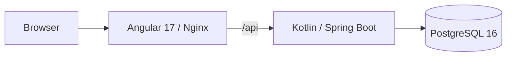

# Casino Wallet

A small casino wallet assignment built with Kotlin, Spring Boot, PostgreSQL and Angular 17.

The project is implemented in small, reviewable vertical slices with a green build required at the end of every stage.

> **Current status:** repository bootstrap only.
>
> The backend currently exposes infrastructure and observability endpoints, while the frontend renders a minimal application shell. Wallet tables, financial APIs, deposits, callbacks, ledger, bonuses, rounds and translations are not implemented yet.

See:

- [IMPLEMENTATION_PLAN.md](IMPLEMENTATION_PLAN.md) — staged implementation roadmap
- [NOTES.md](NOTES.md) — assumptions and architectural decisions

---

## Architecture



The application uses three runtime containers:

```text
Browser
   |
   v
frontend
Angular 17 + Nginx
   |
   | /api
   v
backend
Kotlin + Spring Boot
   |
   | JDBC
   v
postgres
PostgreSQL 16
```

PostgreSQL, backend and frontend run as separate services.

For active development, only PostgreSQL normally runs in Docker. Backend and frontend run locally for faster feedback, debugging and live reload.

The complete Docker Compose stack exists for reproducible clean-clone verification and reviewer convenience.

---

## Repository structure

```text
casino-wallet/
├── backend/                 Spring Boot application and backend Docker image
├── frontend/                Angular application and Nginx Docker image
├── scripts/
│   └── verify.sh            Local verification pipeline
├── compose.yaml             PostgreSQL, backend and frontend
├── README.md
├── NOTES.md
├── IMPLEMENTATION_PLAN.md
├── AGENTS.md
├── .env.example
└── .gitignore
```

The local `docs/` directory contains private development notes and is intentionally excluded from Git.

---

## Technology stack

| Component | Version |
|---|---|
| Java container images | `eclipse-temurin:21.0.12_8-jdk-noble` / `21.0.12_8-jre-noble` |
| Gradle Wrapper | `8.14.3` |
| Kotlin | `2.2.21` |
| Spring Boot | `3.5.16` |
| Testcontainers | `1.21.4` |
| PostgreSQL | `postgres:16.15-alpine3.23` |
| Node builder | `node:20.20.2-alpine3.22` |
| Angular | `17.3.12` |
| Angular CLI | `17.3.17` |
| TypeScript | `5.4.5` |
| Nginx | `nginxinc/nginx-unprivileged:1.28.2-alpine` |

Top-level npm dependencies use exact versions and transitive dependencies are pinned by `package-lock.json`.

Gradle dependency versions are reproducible through the committed Gradle Wrapper and Spring Boot dependency management.

---

## Prerequisites

### Full containerized run

Required:

- Docker Engine or Docker Desktop
- Docker Compose v2

Tested with:

```text
Docker Engine: 28.0.4
Docker Compose: 2.34.0
```

### Local development

Additionally required:

- JDK 21
- Node.js `>=20.9.0 <21`
- npm
- Bash
- Chrome or Chromium
- running Docker daemon for Testcontainers

Recommended Node version:

```text
20.20.2
```

The repository contains `frontend/.nvmrc` for local Node version selection.

Verify the local environment:

```bash
java -version
node --version
npm --version
docker compose version
```

Set `JAVA_HOME` to JDK 21.

If Chrome is not detected automatically by frontend tests, configure `CHROME_BIN`.

---

## Full containerized quick start

Create local environment configuration:

```bash
cp .env.example .env
```

Start the complete stack:

```bash
docker compose up --build
```

The `.env.example` values are disposable local defaults, not production credentials.

The real `.env` file is ignored by Git.

If port `5432` is already occupied, change `POSTGRES_PORT` in `.env`, for example:

```text
POSTGRES_PORT=15432
```

### Service URLs

| Service | Default address |
|---|---|
| Frontend | http://localhost:4200 |
| Frontend health | http://localhost:4200/health |
| Backend health | http://localhost:8080/actuator/health |
| Backend liveness | http://localhost:8080/actuator/health/liveness |
| Backend readiness | http://localhost:8080/actuator/health/readiness |
| Backend info | http://localhost:8080/actuator/info |
| Backend metrics | http://localhost:8080/actuator/metrics |
| PostgreSQL | localhost:5432 |

Inspect the stack:

```bash
docker compose ps
docker compose logs -f
```

Stop it:

```bash
docker compose down
```

The PostgreSQL named volume is preserved.

Use `docker compose down -v` only when the local database should intentionally be deleted.

Both application containers run as non-root users.

Runtime images contain only runtime artifacts, not project source trees or build caches.

---

## Fast local development

### 1. Start PostgreSQL

```bash
docker compose up -d postgres
```

### 2. Start backend

```bash
cd backend
./gradlew bootRun
```

Alternatively, run `CasinoWalletApplication` directly from IntelliJ IDEA using JDK 21.

Spring Boot DevTools supports restart after compiled backend classes change.

### 3. Start frontend

```bash
cd frontend
npm ci
npm start
```

Angular's development server provides live reload.

The development proxy forwards:

```text
/api/* -> http://localhost:8080
```

This keeps browser requests relative and avoids a separate CORS configuration for local development.

The production Nginx container forwards the same relative `/api` requests to:

```text
backend:8080
```

No casino API routes exist yet, so `/api` currently returns `404`. That is expected during the bootstrap stage.

---

## Configuration

Local backend defaults match `.env.example`.

The backend supports:

```text
DB_HOST
DB_PORT
DB_NAME
DB_USER
DB_PASSWORD
SERVER_PORT
```

For local execution, export custom values before starting Spring Boot.

Example:

```bash
export DB_HOST=localhost
export DB_PORT=15432
./gradlew bootRun
```

Spring Boot does not automatically load the repository root `.env` file during direct local execution.

Docker Compose maps its PostgreSQL configuration into the backend container automatically.

---

## Verification

Run the complete local verification pipeline from the repository root:

```bash
./scripts/verify.sh
```

The script can be invoked from any current directory.

It performs:

```text
Backend
  -> Gradle check
  -> backend tests
  -> executable bootJar

Frontend
  -> npm ci
  -> headless Karma/Jasmine tests
  -> Angular production build

Infrastructure
  -> Docker Compose configuration validation
```

The backend Gradle invocation is:

```bash
./gradlew --no-daemon check bootJar
```

Tests requiring PostgreSQL use a real PostgreSQL Testcontainer.

H2 is not used.

Required checks are never silently skipped.

---

## Full-stack smoke test

The complete Docker stack is verified separately from `verify.sh`.

```bash
docker compose config --quiet
docker compose build
docker compose up -d --wait --wait-timeout 180

docker compose ps

curl --fail http://localhost:8080/actuator/health/liveness
curl --fail http://localhost:8080/actuator/health/readiness
curl --fail http://localhost:8080/actuator/metrics

curl --fail -i \
  -H 'X-Request-ID: reviewer-check' \
  http://localhost:8080/actuator/info

curl --fail http://localhost:4200/health
curl --fail http://localhost:4200/

docker compose exec frontend \
  wget -qO- http://backend:8080/actuator/health/readiness

docker compose logs backend frontend

docker compose down
```

Expected result:

```text
postgres  -> healthy
backend   -> healthy
frontend  -> healthy
```

Backend readiness verifies actual PostgreSQL connectivity.

Liveness remains independent of PostgreSQL availability so the application process can remain alive and recover after a temporary database outage.

---

## Reliability strategy

Financial functionality is intentionally not implemented in the bootstrap stage.

Later financial stages follow these rules:

- PostgreSQL is the only durable transactional system.
- Each balance-changing use case executes in one application-service transaction.
- Transaction isolation is `READ_COMMITTED`.
- Wallet-changing operations use `SELECT ... FOR UPDATE`.
- The global lock order is wallet first, then the related deposit when required.
- Wallet changes, ledger entries and related domain state commit or roll back together.
- `REQUIRES_NEW` is not used for financial sub-operations.
- External network calls are not performed while a financial transaction is open.
- A successful financial response is returned only after the database transaction commits.

Money uses:

```text
Kotlin      -> BigDecimal
PostgreSQL  -> NUMERIC(19,2)
```

Binary floating-point values are not used for authoritative money calculations.

Database constraints provide a second protection layer through:

```text
NOT NULL
CHECK
UNIQUE
FOREIGN KEY
append-only protections
```

These financial tables, locks and constraints belong to later implementation stages.

---

## Consistency strategy

Financial state uses strong consistency.

PostgreSQL will be the single source of truth for:

- real balance;
- bonus balance;
- wagering progress;
- deposit state;
- durable callback idempotency.

The future `wallet` table will contain the only mutable current real and bonus balances.

The ledger will be append-only history written in the same transaction as each balance change.

Bonus metadata will not duplicate the mutable current bonus balance.

The frontend treats backend responses as authoritative and does not perform authoritative financial calculations.

Redis, local caches and TTL-based keys are intentionally excluded from financial consistency and idempotency.

---

## Observability

The project provides a lightweight observability baseline without deploying a separate monitoring platform.

### Backend

Spring Boot Actuator exposes:

```text
/actuator/health
/actuator/health/liveness
/actuator/health/readiness
/actuator/info
/actuator/metrics
```

Micrometer provides built-in JVM, HTTP and datasource metrics.

Sensitive Actuator endpoints and sensitive health details are not exposed.

### Request correlation

The backend supports:

```text
X-Request-ID
```

Accepted caller IDs must match:

```text
[A-Za-z0-9._-]{1,128}
```

Otherwise a new UUID is generated.

The effective request ID:

- is returned in the response;
- is stored in MDC during request processing;
- is removed from MDC in `finally`;
- appears in request-completion logs.

Completion logs contain:

```text
request_id
method
path
status
duration
```

Request bodies, query strings, credentials and sensitive headers are not logged.

### Nginx

Nginx:

- exposes `/health`;
- propagates `X-Request-ID`;
- writes access logs to stdout;
- writes errors to stderr;
- records status, request duration and upstream duration.

### Docker Compose

Healthchecks use:

```text
PostgreSQL -> pg_isready
Backend    -> Actuator readiness
Frontend   -> /health
```

Operational inspection uses:

```bash
docker compose ps
docker compose logs -f
```

---

## Angular 17 security constraint

Angular 17 is explicitly required by the assignment and is therefore pinned to:

```text
17.3.12
```

Angular 17 is no longer within the upstream Angular support window.

At the bootstrap review:

```text
npm audit --omit=dev
```

reports:

```text
5 vulnerabilities
2 moderate
3 high
```

in Angular 17 runtime packages.

A full:

```text
npm audit
```

also reports findings in the Angular build/test dependency tree, including deprecated transitive packages.

The automated npm remediation proposes upgrading Angular to a newer major version, which would violate the assignment's explicit Angular 17 requirement.

Therefore this project intentionally does **not** use:

```bash
npm audit fix --force
```

and does not introduce dependency overrides that create an unsupported mixed Angular dependency graph.

The application is deliberately kept as a simple client-side SPA and does not introduce:

- Angular SSR;
- hydration;
- runtime template compilation;
- dynamic HTML rendering;
- unnecessary third-party UI libraries.

For a real production deployment, Angular must be upgraded to a currently supported major version before release.

References:

- Angular release support: https://angular.dev/reference/releases
- Angular version compatibility: https://angular.dev/reference/versions

The audit result is documented rather than hidden: a green build does not imply a clean dependency-security audit.

---

## Intentional exclusions

The following components are intentionally outside the scope of this assignment:

- Redis;
- Kafka;
- API Gateway;
- Kubernetes;
- Prometheus server;
- Grafana;
- Elasticsearch;
- Logstash;
- Kibana;
- WatchDog;
- distributed tracing infrastructure;
- production authentication;
- speculative business dashboards.

They are not required for ACID guarantees or correctness of this application.

Possible production extensions include centralized metrics, log aggregation, tracing, managed PostgreSQL, authentication and secrets management when corresponding operational requirements exist.

---

## Development approach

Implementation proceeds through small vertical slices.

Every stage must:

1. have a clearly bounded scope;
2. produce a reviewable diff;
3. include relevant tests;
4. finish with a green build;
5. preserve the local development workflow;
6. preserve the full Docker Compose smoke test;
7. stop before the next stage until reviewed.

The detailed roadmap is maintained in [IMPLEMENTATION_PLAN.md](IMPLEMENTATION_PLAN.md).